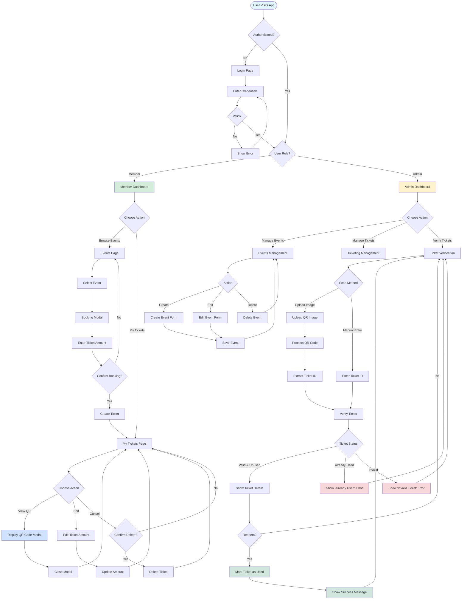
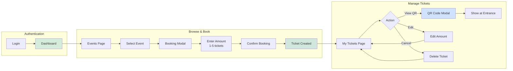
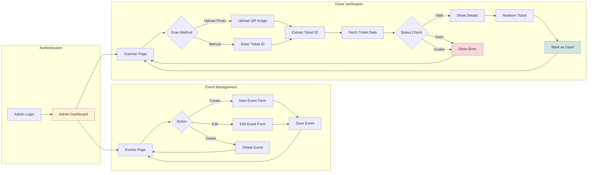
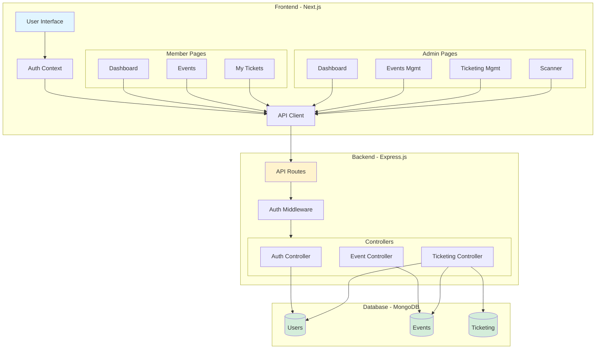
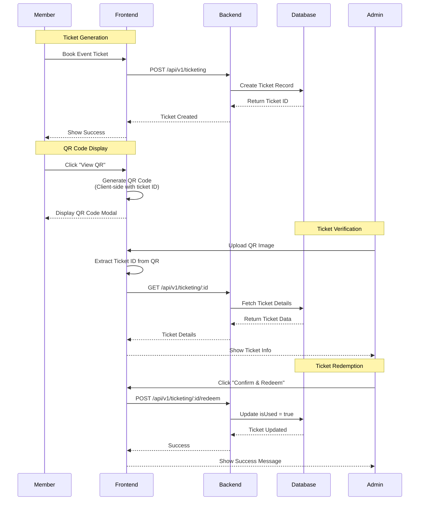
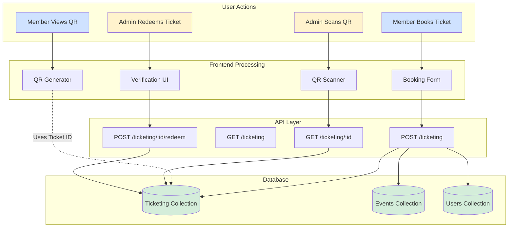
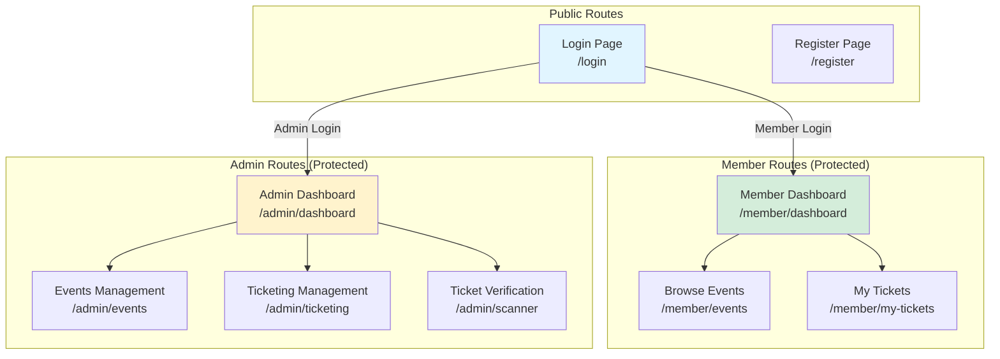

# Event Ticketing System - UI Flow Design

This document provides a comprehensive overview of the user interface flows and system architecture for the Event Ticketing System.

---

## 1. Complete User Journey Flow

---

## 2. Member User Flow (Detailed)

---

## 3. Admin User Flow (Detailed)

---

## 4. System Architecture Overview

---

## 5. QR Code Workflow

---

## 6. Data Flow Diagram

---

## 7. Key Features Summary

### **Member Features:**
1. ✅ Browse available events
2. ✅ Book tickets (1-5 per event)
3. ✅ View QR codes for tickets
4. ✅ Edit ticket amounts
5. ✅ Cancel bookings
6. ✅ See ticket status (Active/Used)

### **Admin Features:**
1. ✅ Manage events (Create/Edit/Delete)
2. ✅ View all ticketing records
3. ✅ Scan QR codes (via image upload)
4. ✅ Manual ticket ID verification
5. ✅ Redeem tickets
6. ✅ Prevent duplicate redemptions

### **Security Features:**
1. ✅ JWT-based authentication
2. ✅ Role-based access control (Member/Admin)
3. ✅ Protected API routes
4. ✅ Ticket validation before redemption

---

## 8. Page Structure

---

## Usage Notes

- **QR Codes**: Generated client-side, contain ticket ID + metadata
- **Image Upload**: Uses `jsQR` library to decode QR codes from photos
- **No Image Storage**: QR images are processed in-browser, not saved to database
- **Ticket Status**: Tracked via `isUsed` boolean field in database
- **Real-time Updates**: Dashboard shows live ticket counts and activity

---

*Generated: 2025-11-19*
